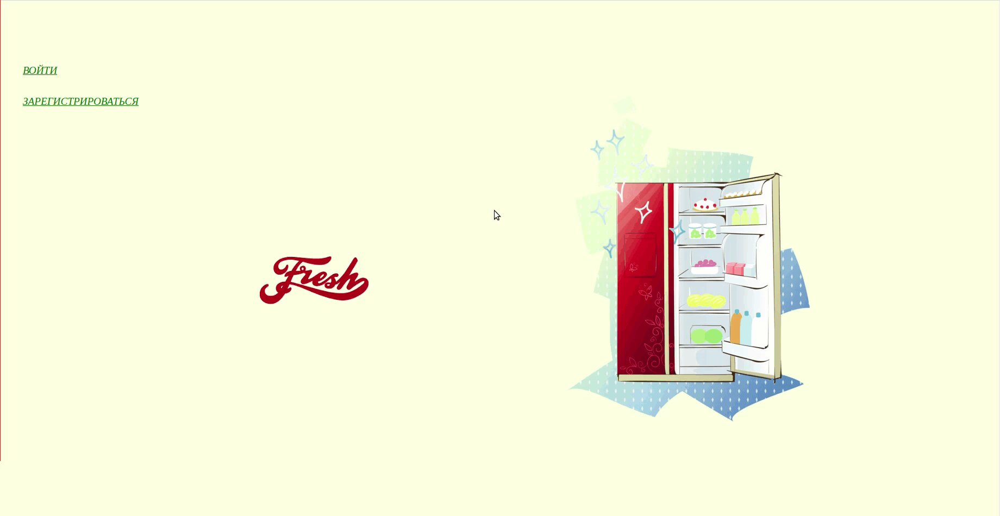
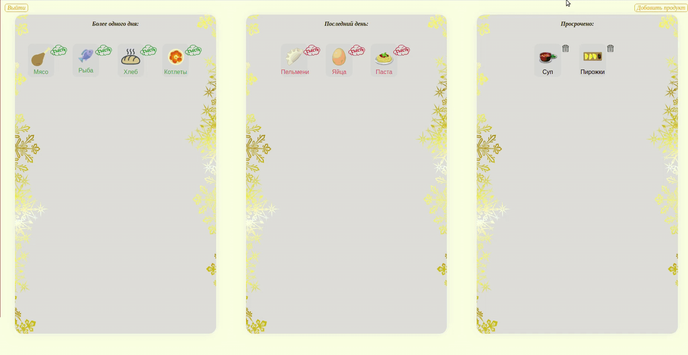
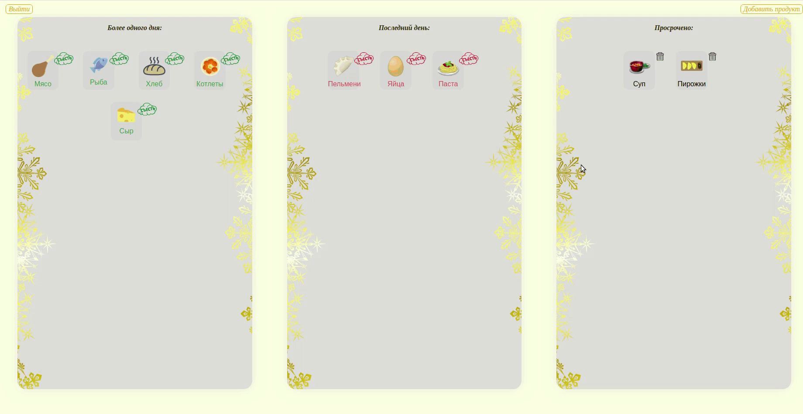

Приложение для контроля срока годности продуктов у вас дома.  

### Регистрация или вход:
Зарестирируйтесь или войдите в личный кабинет.  

### Добавление нового продукта:
Добавьте новый продукт указав его название срок годности или дату производства и предполагаемое количество дней жизни продукта.  

### Управление продуктами питания:
Просматривайте разделы хранимых продуктов и узнавайте, что нужно скоро съесть, а что уже пропало, а также сколько дней еще осталось у остальных.  

 

### Над приложением работали:

* [Мария Богданова](https://github.com/Mariya-Bogdanova);
